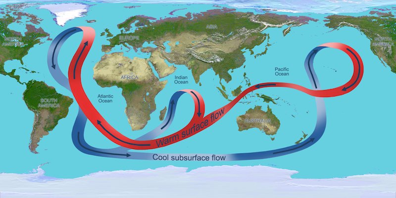

## A visual look at the rivers within the sea  

Far from being a homogenous entity the Atlantic ocean is a transporter of heat and salinity. Stratified in all three axes.  

####  Visual representation of the heat flow within the Atlantic  

The following image illustrates the flows in two dimensions     
 
   
  
The heat flow, driven by the halocline and thermocline differentials within the seemingly homogeneous Atlantic ocean.
  

